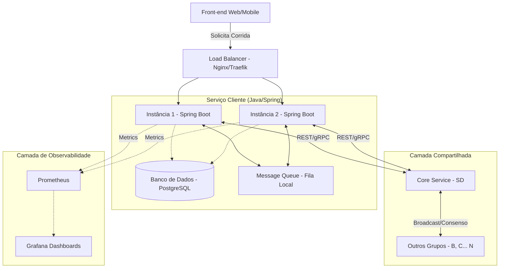

# Especificação da API e Cronograma de Desenvolvimento — Cliente RideFleet

Este documento estabelece a especificação da API HTTP/REST e o cronograma de implementação do serviço cliente para o projeto **RideFleet** (SIN 142 — Sistemas Distribuídos — UFV 2026/1). O serviço será construído utilizando **Java** com o framework **Spring Boot**.

---

## 1. Escopo do Projeto

O **Cliente RideFleet** é um microsserviço de transporte por aplicativo responsável pelo gerenciamento de passageiros, motoristas e ciclo de vida de corridas. 

Seu escopo compreende:
* **Operação Local:** Atendimento de solicitações de corridas usando motoristas próprios cadastrados e disponíveis.
* **Detecção de Congestionamento (Overflow):** Lógica interna para determinar quando o serviço está sem capacidade operacional (ex.: falta de motoristas, tamanho da fila local, latência elevada).
* **Delegação de Saída:** Quando congestionado, interagir com o **Core** para abrir um leilão distribuído, oferecendo a corrida para outros grupos (Serviços parceiros).
* **Delegação de Entrada:** Receber, via **Core**, propostas e solicitações de corridas de serviços parceiros congestionados, enfileirar localmente e atribuir a um motorista disponível.
* **Resiliência e Tolerância a Falhas:** Tratar cenários de falhas de parceiros usando Circuit Breakers e reverter estados inconsistentes usando transações compensatórias (Saga Pattern), garantindo que mensagens sempre transpassem pelo **Core**.
* **Observabilidade e Logs:** Gerar logs estruturados JSON correlacionáveis com relógios lógicos do Core e expor métricas compatíveis com o Prometheus.
* **Alta Disponibilidade:** Executar instâncias redundantes sob um balanceador de carga local.

---

## 2. Descrição Geral da Arquitetura

O sistema é baseado em microsserviços. O cliente interage diretamente com o seu próprio banco de dados relacional (para persistência de estado de corridas, motoristas e passageiros), com filas de mensageria locais (para bufferizar requisições), e com a camada **Core** do ecossistema.



---

## 3. Especificação da API REST (Endpoints)

Abaixo estão definidos os contratos dos endpoints HTTP que o serviço cliente expõe e consome.

### 3.1. Endpoints de Autenticação e Segurança (Públicos)

#### Registrar Passageiro
* **Rota:** `POST /api/v1/auth/passenger/register`
* **Descrição:** Cadastra um novo passageiro no sistema. A senha é armazenada criptografada com hash BCrypt.
* **Payload de Entrada:**
```json
{
  "name": "João da Silva",
  "email": "joao@exemplo.com",
  "phone": "(31) 99999-9999",
  "password": "senhaSegura123"
}
```
* **Respostas:**
  * `201 Created` (Passageiro criado com sucesso).
  * `400 Bad Request` (Email já cadastrado ou dados inválidos).

#### Registrar Motorista
* **Rota:** `POST /api/v1/auth/driver/register`
* **Descrição:** Cadastra um novo motorista no sistema. Status inicial é definido como `OFFLINE`.
* **Payload de Entrada:**
```json
{
  "name": "Maria Souza",
  "vehiclePlate": "ABC-1234",
  "email": "maria@exemplo.com",
  "password": "senhaSegura456"
}
```
* **Respostas:**
  * `201 Created` (Motorista criado com sucesso).
  * `400 Bad Request` (Email/placa já cadastrados ou dados inválidos).

#### Login de Passageiro
* **Rota:** `POST /api/v1/auth/passenger/login`
* **Descrição:** Autentica um passageiro e retorna um token de acesso JWT válido por 24 horas.
* **Payload de Entrada:**
```json
{
  "email": "joao@exemplo.com",
  "password": "senhaSegura123"
}
```
* **Respostas:**
  * `200 OK` (Autenticado com sucesso, retorna o token JWT).
  * `401 Unauthorized` (Credenciais inválidas).
* **Payload de Saída:**
```json
{
  "token": "eyJhbGciOiJIUzI1NiIsInR5cCI6IkpXVCJ9...",
  "role": "ROLE_PASSENGER",
  "id": "uuid-passageiro",
  "name": "João da Silva"
}
```

#### Login de Motorista
* **Rota:** `POST /api/v1/auth/driver/login`
* **Descrição:** Autentica um motorista e retorna um token de acesso JWT válido por 12 horas.
* **Payload de Entrada:**
```json
{
  "email": "maria@exemplo.com",
  "password": "senhaSegura456"
}
```
* **Respostas:**
  * `200 OK` (Autenticado com sucesso, retorna o token JWT).
  * `401 Unauthorized` (Credenciais inválidas).
* **Payload de Saída:**
```json
{
  "token": "eyJhbGciOiJIUzI1NiIsInR5cCI6IkpXVCJ9...",
  "role": "ROLE_DRIVER",
  "id": "uuid-motorista",
  "name": "Maria Souza"
}
```

---

### 3.2. Endpoints para o Front-end / Clientes (Protegidos por JWT)

> [!NOTE]
> Todos os endpoints desta seção exigem o envio do token JWT obtido no login no cabeçalho HTTP:
> `Authorization: Bearer <token>`

#### Solicitar Corrida
* **Rota:** `POST /api/v1/rides/request`
* **Descrição:** Cria uma nova intenção de corrida. Se o serviço estiver em overflow, inicia a delegação pelo Core. Exige `ROLE_PASSENGER`.
* **Payload de Entrada:**
```json
{
  "passengerId": "uuid-passageiro",
  "origin": {
    "latitude": -19.2012,
    "longitude": -46.2231,
    "address": "Prédio de Aulas - UFV"
  },
  "destination": {
    "latitude": -19.2045,
    "longitude": -46.2290,
    "address": "Restaurante Universitário - UFV"
  }
}
```
* **Respostas:**
  * `202 Accepted` (Corrida aceita localmente ou enviada para delegação).
  * `400 Bad Request` (Parâmetros inválidos).
  * `401 Unauthorized` (Token ausente, inválido ou expirado).

#### Obter Detalhes da Corrida
* **Rota:** `GET /api/v1/rides/{id}`
* **Descrição:** Retorna o estado atual da corrida em tempo real. Exige token JWT de passageiro ou motorista.
* **Payload de Saída:**
```json
{
  "rideId": "uuid-corrida",
  "passengerId": "uuid-passageiro",
  "driverId": "uuid-motorista-ou-null",
  "status": "REQUEST | MATCH | CONFIRM | IN_TRANSIT | COMPLETE | DELEGATED | CANCELLED",
  "delegatedToGroup": "Grupo B | null",
  "etaSeconds": 360,
  "price": 18.50,
  "logicalTimestamp": 42
}
```

---

### 3.3. Endpoints de Integração com o Core (Protegidos por X-API-Key)

> [!IMPORTANT]
> Para garantir a segurança das integrações causal-consensuais, todos os endpoints de interoperabilidade exigem o envio da chave secreta compartilhada no cabeçalho HTTP:
> `X-API-Key: <chave-compartilhada>`

Estes endpoints são expostos para o Core acionar o serviço cliente durante os fluxos de delegação distribuída.

#### Solicitar Proposta (Bid Request)
* **Rota:** `POST /api/v1/delegation/bid`
* **Descrição:** Chamado pelo Core quando outro grupo está congestionado. O serviço avalia se tem motoristas livres e retorna uma proposta.
* **Payload de Entrada:**
```json
{
  "rideId": "uuid-corrida",
  "origin": { "latitude": -19.2012, "longitude": -46.2231 },
  "destination": { "latitude": -19.2045, "longitude": -46.2290 },
  "logicalTimestamp": 10
}
```
* **Payload de Saída (200 OK):**
```json
{
  "available": true,
  "etaSeconds": 300,
  "price": 20.00,
  "logicalTimestamp": 11
}
```
* **Payload de Saída (200 OK - Indisponível):**
```json
{
  "available": false,
  "logicalTimestamp": 11
}
```

#### Confirmar Delegação (2PC / Saga Commit)
* **Rota:** `POST /api/v1/delegation/commit`
* **Descrição:** Confirma que a proposta deste grupo venceu o leilão e a corrida deve ser definitivamente atribuída a ele. A corrida entra na Fila de Entrada local.
* **Payload de Entrada:**
```json
{
  "rideId": "uuid-corrida",
  "logicalTimestamp": 15
}
```
* **Resposta:** `200 OK` ou `500 Internal Error` (em caso de erro de persistência).

#### Compensação de Delegação (Saga Rollback)
* **Rota:** `POST /api/v1/delegation/compensate`
* **Descrição:** Se a transação distribuída falhar antes de ser concluída, o Core avisa o grupo para liberar quaisquer recursos e anular a corrida.
* **Payload de Entrada:**
```json
{
  "rideId": "uuid-corrida",
  "reason": "Parceiro indisponível durante confirmação",
  "logicalTimestamp": 18
}
```
* **Resposta:** `200 OK`.

---

### 3.3. Endpoints de Infraestrutura e Monitoramento

#### Health Check
* **Rota:** `GET /health`
* **Descrição:** Retorna a saúde da aplicação para o Docker Compose e monitoramento de rede.
* **Payload de Saída:**
```json
{
  "status": "UP | DEGRADED | DOWN",
  "availableDrivers": 5,
  "incomingQueueSize": 2,
  "outgoingQueueSize": 0,
  "recentLatencyMs": 45
}
```

#### Métricas do Prometheus
* **Rota:** `/actuator/prometheus` (Padrão do Spring Boot Actuator)
* **Métricas expostas customizadas:**
  * `ridefleet_rides_local_total`: Total de corridas atendidas localmente.
  * `ridefleet_rides_delegated_out_total`: Total de corridas delegadas para fora.
  * `ridefleet_rides_delegated_in_total`: Total de corridas recebidas por delegação.
  * `ridefleet_queue_incoming_size`: Tamanho da fila de entrada.
  * `ridefleet_queue_outgoing_size`: Tamanho da fila de saída.
  * `ridefleet_circuit_breaker_state`: Estado atual do circuit breaker interno (CLOSED=0, OPEN=1, HALF_OPEN=2) por serviço parceiro.

---

## 4. Requisitos Não Funcionais (Mecanismos e Arquitetura)

1. **Persistência de Dados:** Uso de banco relacional (ex.: PostgreSQL) com Spring Data JPA para garantir ACID nas operações locais.
2. **Filas de Corridas:** 
   * **Fila de Entrada:** buffer de corridas recebidas por delegação, persistido no banco de dados ou RabbitMQ local.
   * **Fila de Saída:** buffer de corridas locais congestionadas que aguardam delegação via Core.
3. **Load Balancer:** Configuração de Docker Compose com pelo menos duas instâncias da aplicação Spring Boot e um container Nginx/Traefik na frente.
4. **Relógios Lógicos:** Implementação de um contador de relógio lógico de Lamport que é incrementado a cada evento e sincronizado a partir das mensagens do Core (atualiza com $\max(local, recebido) + 1$).
5. **Circuit Breaker:** Máquina de estados explícita para chamadas aos serviços parceiros (via Core). Se as chamadas para delegação de um parceiro falharem sistematicamente, o circuito abre e aciona o fallback (tentar outro parceiro ou enfileirar localmente na Fila de Saída).

---

## 5. Cronograma de Tarefas (Divisão por Módulos / Semanas)

Abaixo estão descritas as tarefas técnicas mapeadas especificamente para a stack Java / Spring Boot.

### 🗓️ Semana 1 — Modelagem e Back-end Central
*Foco: Lógica de negócio, entidades JPA e regras de overflow.*

- [x] **Configuração do Projeto:** Inicializar projeto Spring Boot (Web, JPA, Actuator, PostgreSQL/H2).
- [x] **Modelagem do Banco de Dados:** Criar entidades JPA para `Passenger`, `Driver` e `Ride`.
- [x] **Máquina de Estados de Corrida:** Implementar máquina de estados da corrida (`REQUEST` -> `MATCH` -> `CONFIRM` -> `IN_TRANSIT` -> `COMPLETE`) com validações no banco de dados.
- [x] **Serviço de Motoristas:** Criar endpoints CRUD de motoristas e gerenciamento de status (Disponível, Em Corrida, Offline).
- [x] **Regra de Overflow:** Implementar lógica de detecção de overflow (ex: se o número de motoristas disponíveis for 0 ou a latência média for alta, marcar o status como congestionado).
- [x] **Testes de Unidade:** Desenvolver testes unitários para a máquina de estados e regra de overflow usando JUnit 5 e Mockito.

### 🗓️ Semana 2 — Logging, Monitoramento, Fila e Load Balancer
*Foco: Infraestrutura do microsserviço cliente.*

- [ ] **Logging Estruturado:** Configurar Logback/Log4j2 para gerar logs estruturados em formato JSON no stdout contendo: `timestamp`, `evento`, `corrida_id`, `servico_origem`, `estado_anterior`, `estado_novo` e o `logicalTimestamp`.
- [ ] **Health Check Customizado:** Criar um `HealthIndicator` customizado do Spring Boot Actuator para expor no `/health` o estado (`UP` / `DEGRADED`), fila de corridas e motoristas disponíveis.
- [ ] **Fila de Corridas:** Implementar fila persistente (usando RabbitMQ local ou tabelas do banco com processamento assíncrono via `@Scheduled` / Spring Integration) para desacoplar as solicitações de corridas.
- [ ] **Load Balancer (Nginx/Docker):** Escrever o arquivo `docker-compose.yml` contendo duas instâncias do app Java e uma instância de Nginx configurada para Round-Robin.

### 🗓️ Semana 3 — Integração com o Core e Delegação
*Foco: Clientes HTTP e fluxos distribuídos do Core.*

- [ ] **Cliente HTTP do Core:** Criar um serviço Java (usando `WebClient` ou `RestTemplate`) para consumir os contratos da API do Core (travas, leilões, registro de log causal).
- [ ] **Delegação de Saída (Overflow):** Lógica que, ao receber uma corrida em overflow, faz chamada assíncrona ao Core para iniciar o leilão.
- [ ] **Delegação de Entrada:** Implementar endpoints `/api/v1/delegation/bid`, `/commit` e `/compensate` para responder a leilões e participar da Saga/2PC iniciada por outros serviços.
- [ ] **Sincronização de Relógio Lógico:** Implementar thread-safe counter do relógio de Lamport em Java, atualizando a cada evento de envio e recebimento de payloads.

### 🗓️ Semana 4 — Front-End
*Foco: Interface de usuário responsiva e integração.*

- [ ] **Integração Front-Back:** Conectar a interface gráfica (HTML/JS ou SPA) às APIs REST de solicitação de corrida.
- [ ] **Painel de Acompanhamento:** Desenvolver tela que atualiza em tempo real o status da corrida (usando WebSocket com Spring SocketJS/Stomp ou Server-Sent Events).
- [ ] **Visualização de Delegação:** Garantir que, se a corrida foi delegada para fora ou veio de fora, o front-end exiba com destaque a identidade do grupo parceiro encarregado.

### 🗓️ Semana 5 — Observabilidade e Pipeline CI/CD
*Foco: Métricas automatizadas e deploy contínuo.*

- [ ] **Métricas Customizadas:** Registrar métricas customizadas no `MeterRegistry` do Micrometer (Spring Boot) para o número de corridas locais, delegadas e tamanhos das filas.
- [ ] **Dashboard Grafana:** Mapear as métricas para que fiquem compatíveis com os painéis gerais do Core.
- [ ] **Pipeline CI/CD:** Configurar fluxo automatizado (ex.: GitHub Actions ou GitLab CI) para executar o build Gradle/Maven, testes unitários, testes de integração e empacotamento da imagem Docker.

### 🗓️ Semana 6 — Resiliência Avançada e Interoperabilidade
*Foco: Testes de stress, injeção de falhas e Circuit Breaker.*

- [ ] **Mecanismo de Circuit Breaker:** Implementar uma máquina de estados de Circuit Breaker customizada (CLOSED, OPEN, HALF_OPEN) em Java para isolar falhas de parceiros específicos durante chamadas de bid/commit.
- [ ] **Lógica de Fallback:** Configurar fallback da delegação (se parceiro falha ou circuito abre, tenta o próximo melhor lance ou guarda na Fila de Saída para reprocessamento posterior).
- [ ] **Testes de Integração Real:** Participar de rodadas de testes integrados com os serviços dos outros grupos simulando lentidões e falhas de conexão.

### 🗓️ Semana 7 — Apresentação e Validação Final
*Foco: Validação geral e auditoria.*

- [ ] **Auditoria de Relógio Lógico:** Garantir que o endpoint de auditoria causal do Core consegue consultar com sucesso os logs estruturados e correlacionar a ordem temporal das mensagens.
- [ ] **Simulação de Stress e Falhas:** Testar derrubar uma instância local por trás do Nginx e verificar que o sistema permanece responsivo.
- [ ] **Preparação de Slides e Demo:** Organizar roteiro de demonstração (Fluxo feliz, Fluxo com overflow e delegação de sucesso, Fluxo de falha de parceiro acionando fallback).
